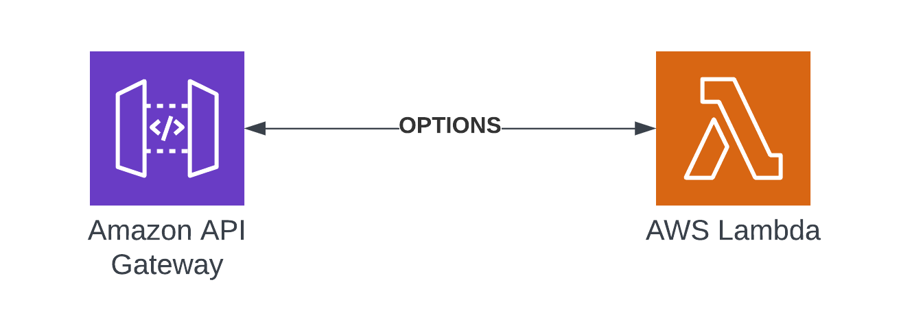
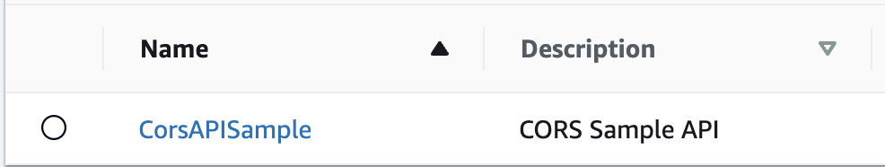
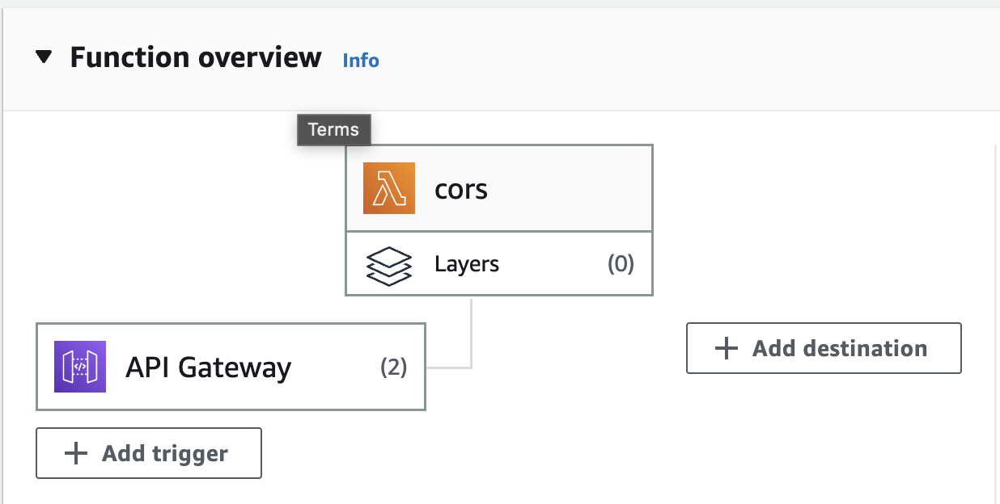

# API Gateway CORS Allow-list with a Lambda Function in Rust

Repository supports the article written at [Binaryheap](https://www.binaryheap.com/cross-origin-allowlist-with-api-gateway/)



This code demonstrates how to create a allow list of domains that can be validated when CORS Pre-flight requests are made.

By instrumenting CORS, a browser's request will be validated against an OPTIONS request inside of API Gateway. API Gateway only allows a single domain to be registered or a `*` can be utilized to allow all domains. In the case of more restriction and more flexibility, a Allowlist of allowed domains can be built using a Lambda that is executed via a Proxy Integration.

## Deployment Instructions

1. Clone the repository
2. Change directory
3. Install the project dependencies
    ```
     npm install
    ```
4. Deploy the stack to your default AWS account and region
    ```
    cdk deploy
    ```

## How it works

Here is what gets deployed into an AWS Account

-   API Gateway that will be the harness for running the CORS request
-   Lambda Function developed in Rust that will run when the OPTIONS request is executed

When deployed there will be an API Gateway created that looks like this.



Additionally, the Lambda that is used to run the checks against the allowlist will look this way.



## Cleanup

1. Delete the stack

```bash
cdk destroy
```
